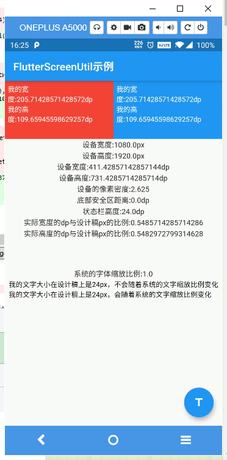
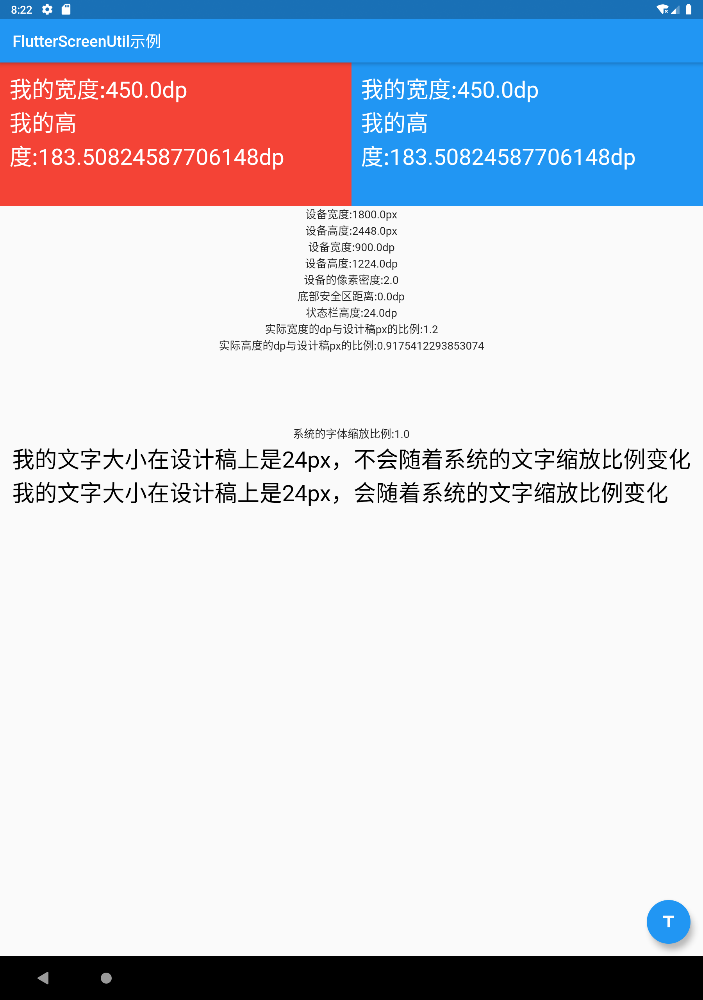
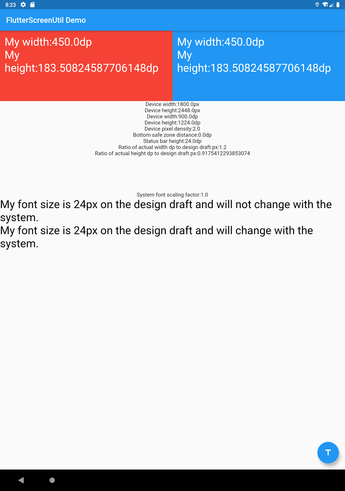

# Example







```dart
void main() {
  WidgetsFlutterBinding.ensureInitialized();
  //Set the fit size (fill in the screen size of the device in the design) If the design is based on the size of the iPhone6 ​​(iPhone6 ​​750*1334)
  ScreenUtil.init(designSize: Size(750, 1334), allowFontScaling: false);
  runApp(MyApp());
}

class MyApp extends StatelessWidget {
  @override
  Widget build(BuildContext context) {
    return MaterialApp(
      debugShowCheckedModeBanner: false,
      title: 'Flutter_ScreenUtil',
      theme: ThemeData(
        primarySwatch: Colors.blue,
      ),
      home: ExampleWidget(title: 'FlutterScreenUtil Demo'),
    );
  }
}

class ExampleWidget extends StatefulWidget {
  const ExampleWidget({Key key, this.title}) : super(key: key);

  final String title;

  @override
  _ExampleWidgetState createState() => _ExampleWidgetState();
}

class _ExampleWidgetState extends State<ExampleWidget> {
  @override
  Widget build(BuildContext context) {
    printScreenInformation();
    return Scaffold(
      appBar: AppBar(
        title: Text(widget.title),
      ),
      body: SingleChildScrollView(
        child: Column(
          crossAxisAlignment: CrossAxisAlignment.center,
          children: <Widget>[
            Row(
              children: <Widget>[
                // Using Extensions
                Container(
                  padding: EdgeInsets.all(10.w),
                  width: 0.5.wp,
                  height: 200.h,
                  color: Colors.red,
                  child: Text(
                    'My width:${0.5.wp}dp \n'
                    'My height:${200.h}dp',
                    style: TextStyle(
                      color: Colors.white,
                      fontSize: 24.sp,
                    ),
                  ),
                ),
                // Without using Extensions
                Container(
                  padding: EdgeInsets.all(ScreenUtil().setWidth(10)),
                  width: ScreenUtil().screenWidth * 0.5,
                  height: ScreenUtil().setHeight(200),
                  color: Colors.blue,
                  child: Text(
                    'My width:${ScreenUtil().screenWidth * 0.5}dp \n'
                    'My height:${ScreenUtil().setHeight(200)}dp',
                    style: TextStyle(
                      color: Colors.white,
                      fontSize: ScreenUtil().setSp(24),
                    ),
                  ),
                ),
              ],
            ),
            Text('Device width:${ScreenUtil().screenWidthPx}px'),
            Text('Device height:${ScreenUtil().screenHeightPx}px'),
            Text('Device width:${ScreenUtil().screenWidth}dp'),
            Text('Device height:${ScreenUtil().screenHeight}dp'),
            Text('Device pixel density:${ScreenUtil().pixelRatio}'),
            Text('Bottom safe zone distance:${ScreenUtil().bottomBarHeight}dp'),
            Text('Status bar height:${ScreenUtil().statusBarHeight}dp'),
            Text(
              'Ratio of actual width dp to design draft px:${ScreenUtil().scaleWidth}',
              textAlign: TextAlign.center,
            ),
            Text(
              'Ratio of actual height dp to design draft px:${ScreenUtil().scaleHeight}',
              textAlign: TextAlign.center,
            ),
            SizedBox(
              height: ScreenUtil().setHeight(100),
            ),
            Text('System font scaling factor:${ScreenUtil().textScaleFactor}'),
            Column(
              crossAxisAlignment: CrossAxisAlignment.start,
              children: <Widget>[
                Text(
                  'My font size is 24px on the design draft and will not change with the system.',
                  style: TextStyle(
                    color: Colors.black,
                    fontSize: 24.sp,
                  ),
                ),
                Text(
                  'My font size is 24px on the design draft and will change with the system.',
                  style: ts.t1,
                ),
              ],
            )
          ],
        ),
      ),
      floatingActionButton: FloatingActionButton(
        child: Icon(Icons.title),
        onPressed: () {
          ScreenUtil.init(
            designSize: Size(1500, 1334),
            allowFontScaling: false,
          );
          setState(() {});
        },
      ),
    );
  }

  void printScreenInformation() {
    print('Device width dp:${ScreenUtil().screenWidth}'); //Device width
    print('Device height dp:${ScreenUtil().screenHeight}'); //Device height
    print(
        'Device pixel density:${ScreenUtil().pixelRatio}'); //Device pixel density
    print(
        'Bottom safe zone distance dp:${ScreenUtil().bottomBarHeight}'); //Bottom safe zone distance，suitable for buttons with full screen
    print(
        'Status bar height px:${ScreenUtil().statusBarHeight}dp'); //Status bar height , Notch will be higher Unit px
    print(
        'Ratio of actual width dp to design draft px:${ScreenUtil().scaleWidth}');
    print(
        'Ratio of actual height dp to design draft px:${ScreenUtil().scaleHeight}');
    print(
        'The ratio of font and width to the size of the design:${ScreenUtil().scaleWidth * ScreenUtil().pixelRatio}');
    print(
        'The ratio of  height width to the size of the design:${ScreenUtil().scaleHeight * ScreenUtil().pixelRatio}');
    print('System font scaling:${ScreenUtil().textScaleFactor}');
    print('0.5 times the screen width:${0.5.wp}');
    print('0.5 times the screen height:${0.5.hp}');
  }
}
```
 
